#  Hybrid-Analyzer : Plateforme d'Orchestration IA


## Context du projet

**Hybrid-Analyzer** est une application Fullstack conçue pour les agences de monitoring média. Elle automatise l'analyse de centaines d'articles de presse quotidiens en orchestrant deux services d'Intelligence Artificielle complémentaires :

1.  **Hugging Face (Zero-Shot Classification)** : Identifie instantanément la catégorie d'un article (Politique, Économie, Tech, etc.) sans entraînement préalable.
2.  **Google Gemini (GenAI)** : Utilise la catégorie identifiée pour générer un résumé contextuel précis et analyser la tonalité (Sentiment Analysis).

---

##  Architecture Technique

Le projet est entièrement conteneurisé via Docker. Le backend (FastAPI) agit comme une passerelle d'orchestration entre le frontend (React), la base de données et les services IA externes.

```mermaid
graph LR
    %% --- DEFINITION DES COULEURS (Palette Claire et Visible) ---
    %% Bleu Ciel
    classDef docker fill:#BBDEFB,stroke:#1565C0,stroke-width:2px,color:#000;
    %% Violet
    classDef ext fill:#E1BEE7,stroke:#7B1FA2,stroke-width:2px,color:#000;
    %% Orange
    classDef db fill:#FFE0B2,stroke:#EF6C00,stroke-width:2px,color:#000;
    %% Vert
    classDef ai fill:#C8E6C9,stroke:#2E7D32,stroke-width:2px,color:#000;

    %% Style des flèches
    linkStyle default stroke:#37474F,stroke-width:2px;

    %% Acteur
    User((👤 Utilisateur)):::ext

    %% --- ZONE DOCKER COMPOSE ---
    %% Le texte entre crochets [] ci-dessous est celui qui s'affiche dans la zone
    subgraph DC [🐳 Docker Compose]
        direction LR
        UI[ Frontend Container]:::docker
        
        subgraph Backend [⚡ Backend API]
            direction TB
            Router[⚙️ FastAPI Router]:::docker
            Logic[🧠 FastAPI Logic]:::docker
        end
        
        DB[(🗄️ Database)]:::db
    end

    %% --- ZONE IAs EXTERNES ---
    subgraph AI_Services [☁️ IAs Externes]
        HF[🤗 Hugging Face API]:::ai
        GEM[G Google Gemini API]:::ai
    end

    %% --- CONNEXIONS ---
    User -->|Http| UI
    UI -->|API Call| Router
    Router -->|Dispatch| Logic
    Logic -->|SQLalchemy| DB
    
    %% Connexions vers les IAs
    Logic -.->|Request| HF
    Logic -.->|Request| GEM

    %% Style du cadre (Fond blanc, bordure bleue pointillée)
    style DC fill:#FFFFFF,stroke:#1565C0,stroke-width:3px,stroke-dasharray: 5 5
    style AI_Services fill:#F1F8E9,stroke:#2E7D32,stroke-width:2px,stroke-dasharray: 5 5

```



## Workflow d'Analyse (Séquence)

```mermaid
sequenceDiagram
    participant U as Utilisateur (React)
    participant B as Backend (FastAPI)
    participant D as Base de Données
    participant HF as Hugging Face
    participant G as Google Gemini

    Note over U,B: Authentification requise (JWT)
    
    U->>B: POST /analyze (Texte brut)
    activate B
    B->>B: Validation Token & Input
    
    %% NOUVELLE ÉTAPE AJOUTÉE ICI
    B->>D: Sauvegarde/Vérification User (Table USER)
    note right of B: S'assure que l'utilisateur existe<br/>pour lier les logs ensuite
    
    rect rgba(91, 161, 223, 1)
        note right of B: Étape 1 : Classification
        B->>HF: POST (Texte) -> Bart-Large-MNLI
        HF-->>B: Retourne {Label: "Finance", Score: 0.96}
    end
    
    rect rgba(218, 89, 132, 1)
        note right of B: Étape 2 : Synthèse Contextuelle
        B->>B: Création Prompt: "Agis comme un expert en Finance..."
        B->>G: POST (Prompt + Texte Original)
        G-->>B: Retourne {Résumé, Ton: "Positif"}
    end

    B->>D: Sauvegarde Log (Table LOGS: id, user_id, result...)
    B-->>U: Réponse JSON {Catégorie, Résumé, Ton, Score}
    deactivate B
    
    U->>U: Mise à jour du Dashboard (Cartes de résultats)

```


## Installation et Lancement 
  Le projet utilise Docker Compose pour lancer simultanément le Backend, le Frontend et la Base de données.
 1. Prérequis
    Docker & Docker Compose installés.
    Clé API Hugging Face (Gratuite).
    Clé API Google Gemini (Google AI Studio).
 2. Configuration (.env)
  Avant de lancer l’application, vous devez créer un fichier `.env` dans le dossier **backend**  
 a fin de configurer la base de données, les clés IA et la sécurité.

   - Créez le fichier : .env
   - 
Puis ajoutez-y le contenu suivant :

```env
# --- DATABASE CONFIG ---
POSTGRES_USER=hybrid_user
POSTGRES_PASSWORD=secure_password
POSTGRES_DB=hybrid_db
DATABASE_URL=postgresql://hybrid_user:secure_password@db:5432/hybrid_db

# --- SECURITY (JWT) ---
SECRET_KEY=votre_cle_secrete_ultra_longue_et_aleatoire

# --- AI SERVICES KEYS ---
HF_API_TOKEN=hf_xxxxxxxxxxxxxxxxxxxxxxxxxxxxxx
GEMINI_API_KEY=AIzaSyxxxxxxxxxxxxxxxxxxxxxxxxxxxxxx
```
3. Démarrage
Lancez l'ensemble de la stack :
```bash
docker-compose up --build -d
```

## Documentation API (FastAPI)
FastAPI génère automatiquement une documentation interactive Swagger. Voici les endpoints clés :
+ Authentification
    - POST /auth/register : Création de compte utilisateur.
    - POST /auth/token : Login (renvoie un access_token JWT).
+ Core (Protégé par JWT)
   - POST /analyze/text
   - Payload : {"text": "Contenu de l'article..."}
   - Header :  token
   - Réponse :
      ```json 
      {
        "categorie": "Intelligence artificielle",
        "score": 55.1,
       "resume": "Cette plateforme utilise l'IA et l'ingénierie logicielle pour des analyses avancées. Elle transforme les données en insights exploitables, assurant performance, sécurité et scalabilité. C'est une solution complète et efficace.",
      "ton": "positive"
      }
  
     ```


## Gestion des Erreurs

|  Incident  |   Code HTTP |
|------------|--------------|
| Token invalide ou absent | 401 Unauthorized |
| Données envoyées invalides | 422 Unprocessable Entity |
| Hugging Face Timeout | 504 Gateway Timeout |
| Hugging Face Erreur Réseau | 502 Bad Gateway |
| Gemini indisponible | 503 Service Unavailable |
| Réponse Gemini mal formée / JSON invalide | 500 Internal Server Error |
| Score de classification trop faible | 400 Bad Request |

## Limites Techniques (Double Dépendance IA)

- **Latence cumulée** : chaque requête passe par Hugging Face puis Gemini → temps de réponse plus long.  
- **Disponibilité** : downtime d’un service → workflow impacté, nécessite mode dégradé.  
- **Quotas & coûts** : usage intensif → coûts ou limites d’API.  
- **Variabilité des réponses** : évolution des modèles → incohérences possibles.  
- **Gestion des erreurs complexe** : timeouts, réponses mal formées, scores faibles.  
- **Sécurité / confidentialité** : données envoyées à des services externes → anonymisation recommandée.


## Tests Unitaires (Backend)
Pour lancer les tests (nécessite Python localement) :
```bash
cd backend
# Créer un environnement virtuel
python -m venv venv
source venv/bin/activate
# Installer les dépendances
pip install -r requirements.txt
# Lancer les tests
pytest  -v 

```
   Note : Les tests utilisent unittest.mock pour simuler Hugging Face et Gemini. Ils ne consomment pas vos crédits API.
##  Structure du Projet : Plateforme_Orchestration_IA_Backend
```bash
Plateforme_Orchestration_IA_Backend/
│
├── api_app/                        # Application Principale
│   ├── __init__.py
│   ├── main.py                     #  Point d'entrée FastAPI
│   ├── database.py                 #  SessionLocal & Base
│   ├── dependencies.py             #  get_db
│   ├── logger.py                   # Config Logging
│   │
│   ├── core/                       # Configuration & Sécurité
│   │   ├── __init__.py
│   │   ├── config.py               # Variables d'environnement (.env loading)
│   │   └── security.py             # Hashage mot de passe & Création JWT
│   │
│   ├── Crud/                       #  Interaction DB
│   │   ├── __init__.py
│   │   └── crud_user.py            #  creation du nouvelle user
│   │
│   ├── models/                     
│   │   ├── __init__.py
│   │   ├── Users.py                # Table utilisateurs
│   │   └── AnalysisLog.py          # Table logs d'analyse
│   │
│   ├── outils/                      Utilitaires 
│   │   ├── __init__.py
│   │   ├── anlyse_text.py          # Integration HF et Gemini
│   │   └── save_analysis.py        # Fonction de sauvegarde logs d'analyse en DB
│   │
│   ├── routers/                    # Routes API
│   │   ├── __init__.py
│   │   ├── analyse.py              # Endpoint POST /analyze
│   │   └── auth.py                 # Endpoints /login, /register
│   │
│   ├── schemas/                    #  Validation de données (Pydantic)
│   │   ├── __init__.py
│   │   ├── analyse.py              # Schema Request/Response pour l'analyse
│   │   ├── user.py                 # Schema UserRegister, UserLogin
│   │   └── serv_gemini.py          # Schema spécifique pour réponse Gemini 
│   │
│   └── services/                   #  Logique Métier (IA)
│       ├── __init__.py
│       ├── service_Gemini.py       # Appel API Google Gemini
│       └── service_HF.py           # Appel API Hugging Face
│
├── Tests/                          #  Tests Unitaires (Mock)
│   ├── __init__.py
│   ├── test_chainage_complet.py
│   ├── test_mock_Gemini.py
│   └── test_mock_HF.py
│
├── .dockerignore
├── .gitignore
├── Dockerfile
├── Readme.md                       
└── requierements.txt               

```bash
## Auteur

**Nom :** KHADIJA ELABBIOUI  
**Email :** khadija.elabbioui1999@gmail.com  
**LinkedIn :** [linkedin.com/in/khadija-elabbioui](https://www.linkedin.com/in/khadija-elabbioui-308499216/)  
**GitHub :** [github.com/ton-github](https://github.com/khadija199904)